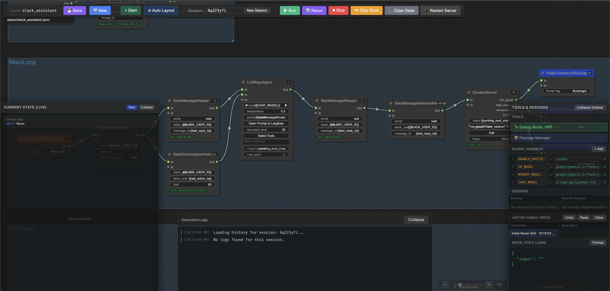
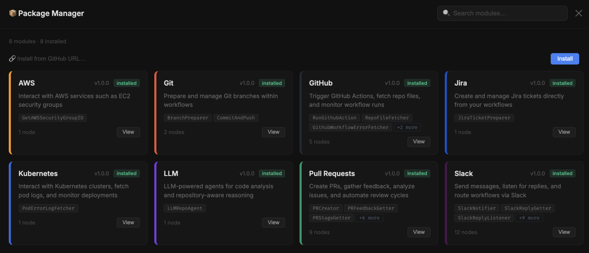

```
  ┌─┐┌┬┐┌─┐┌─┐┬┌─┌─┐┬  ┌─┐┬ ┬
  └─┐ │ ├─┤│  ├┴┐├┤ │  │ ││││
  └─┘ ┴ ┴ ┴└─┘┴ ┴└  ┴─┘└─┘└┴┘
```

**Build, run, and monitor AI-powered workflows** — visually. StackFlow gives you a drag-and-drop graph editor, a LangGraph execution engine, and full Langfuse observability, all wired together with a one-command setup.





---

## Get started

```bash
curl -fsSL https://raw.githubusercontent.com/your-org/StackFlow/main/install.sh | bash
stackflow start
```

Open **http://localhost:5173** and start building.

The install script handles everything: Python, Node.js, Docker via Colima, PostgreSQL, Langfuse — no manual setup required.

---

## What's inside

- 🎨 **Visual editor** — Drag-and-drop graph editor with subgraphs, live execution status, undo/redo, and a variables panel
- 🤖 **LangGraph engine** — Stateful execution with PostgreSQL checkpointing and automatic resume on failure
- 🧩 **Module system** — Install integrations at runtime; each ships its own nodes, dependencies, and credentials
- 📡 **Langfuse observability** — Every execution is fully traced with spans, inputs, and outputs

---

## Modules

Install the integrations you need:

```bash
stackflow pm list                 # see what's available
stackflow pm install slack        # install a module
stackflow pm install all          # install everything
```

| Module | Nodes |
|--------|-------|
| **AWS** | EC2 security groups |
| **Git** | Branch management, commits |
| **GitHub** | Actions, file fetching, workflow monitoring |
| **Jira** | Ticket creation and management |
| **Kubernetes** | Pod logs, deployment monitoring |
| **LLM** | Repo-aware agents (OpenAI, Ollama, Gemini, and more) |
| **Pull Requests** | Full PR lifecycle — create, review, resolve, categorize |
| **Slack** | Messages, reactions, routing, assistant flows |

---

## CLI

```bash
stackflow start              # start everything (returns immediately)
stackflow stop               # stop API + editor
stackflow stop all           # stop everything including Docker infra
stackflow restart            # restart API server
stackflow restart ui         # restart editor
stackflow logs               # last 50 lines of API logs
stackflow logs ui -f         # follow UI logs
stackflow docker             # Docker container status
stackflow pm <command>       # package manager
```

---

## Services

| Service | URL |
|---------|-----|
| Editor | http://localhost:5173 |
| API | http://localhost:8000 |
| Langfuse | http://localhost:3000 &nbsp;·&nbsp; `admin@stackflow.local` / `adminadmin` |

---

## Requirements

macOS with [Homebrew](https://brew.sh). Everything else — Python 3.11+, Node.js, Docker, Colima — is installed by `./install.sh`.
